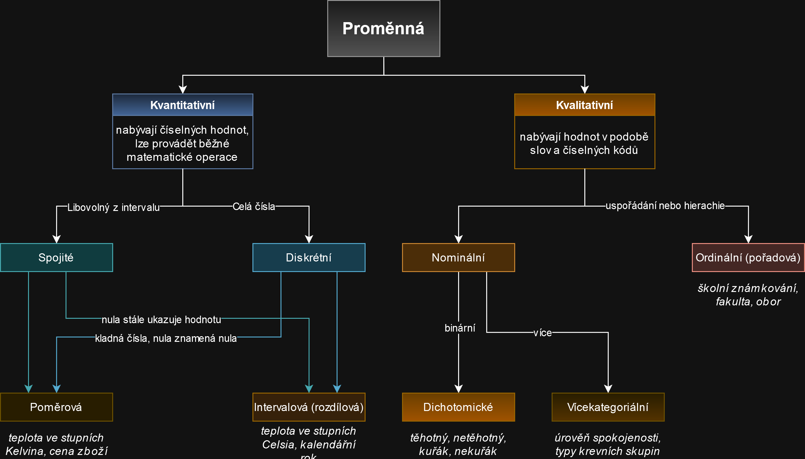

# Klasifikace proměnných a typů dat ve statistice

Proměnné lze klasifikovat podle různých kritérií. Základní klasifikace zahrnuje:

1. **Kvalitativní (kategoriální) proměnné**:
   - **Nominální**: Proměnné, které nemají přirozené pořadí.
   - **Ordinační**: Proměnné, které mají přirozené pořadí, ale rozdíly mezi hodnotami nejsou měřitelné.
   - **Dichotomické**: Proměnné, které mají pouze dvě kategorie.
   - **Vícekategorické**: Proměnné, které mají více než dvě kategorie.

2. **Kvantitativní (číselné) proměnné**:
   - **Diskrétní**: Proměnné, které nabývají konečného nebo spočetného množství hodnot.
   - **Kontinuální**: Proměnné, které mohou nabývat libovolné hodnoty v určitém intervalu.
   - **Intervalové**: Proměnné, kde rozdíly mezi hodnotami jsou měřitelné, ale nemají přirozený nulový bod.
   - **Poměrové**: Proměnné, které mají přirozený nulový bod a rozdíly mezi hodnotami jsou měřitelné.

# Typy dat

Data lze rozdělit do několika typů:

1. **Číselná data**:
   - **Celá čísla**: Data, která jsou celými čísly.
   - **Reálná čísla**: Data, která mohou být jakýmkoli reálným číslem.

2. **Textová data**:
   - **Řetězce**: Data, která jsou textovými řetězci.

3. **Logická data**:
   - **Boolean**: Data, která mohou nabývat pouze dvou hodnot (pravda/nepravda).

